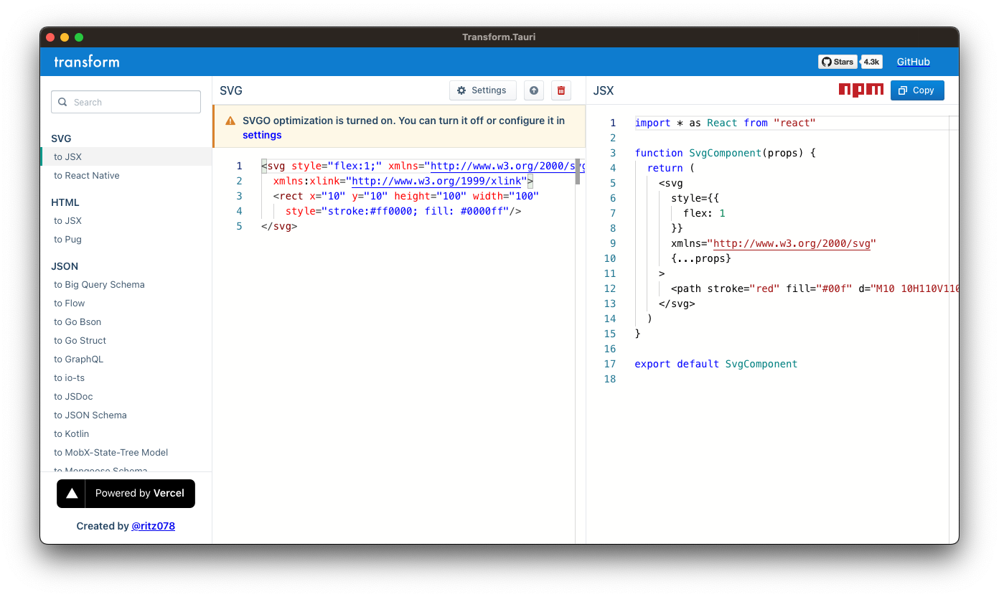

# Transform.Tauri

A [transform.tools] bundler built with [Tauri]. 

## Screenshots

## Build your own binaries

1. Clone code recursively.
2. Make sure you have node.js 16, yarn 1.x, cargo, Rust and tauri-cli installed.
3. Run `cargo tauri build` at the root of local clone of this project.

[transform.tools]: https://transform.tools/
[Tauri]: https://tauri.studio/
